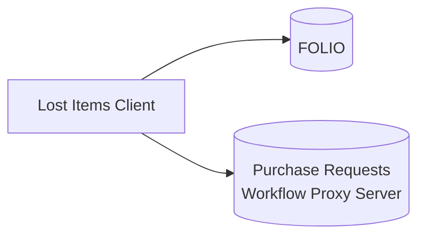

# Purchase Request Lost Items Client

The Lost Items client helps a library determine whether to replace lost or missing items.  The client:

* Monitors the FOLIO LSP for items newly marked lost.
* Submits purchase requests for newly identified items to the [Purchase Request Workflow Proxy Server](https://github.com/lehigh-university-libraries/purchase-request-workflow-proxy-server) for consideration by librarian selectors.
    * The Workflow Proxy Server centralizes purchase requests from different sources, enriches them with information to help selector decision-making, and routes them to external systems for post-decision processing.
* Updates the FOLIO inventory records once a decision is made.

## Identifying Lost Items

The Lost Items Client identifies for purchase consideration items that meet **all** of the following criteria:

* The Item Status matches any of those in a configured list of lost/missing status values, such as "Declared lost".
* Suppress Discovery is false on the item record.
* The item has not already been identified (it does not have an `In Lost Item Workflow` statistical code).

Once identified and submitted to the Purchase Request Workflow Proxy Server, the FOLIO item record is marked as under consideration by:

* Adding an `In Lost Item Workflow` statistical code
* Adding an item note of type `Lost Item Tag` whose value is the purchase request ID from the Workflow Proxy Server.

The client searches FOLIO for lost items on a configurable schedule.  

## Updating FOLIO After a Decision

*The underlying expectation is that if a new purchase is approved, library staff will create a new item record to represent it.  Therefore the existing record should be withdrawn regardless of which decision is made.*

Once a purchase decision is made, whether Approve or Deny, the client updates the FOLIO **item record**:

* removes the `In Lost Item Workflow` statistical code
* removes the `Lost Item Tag` item note
* sets the item status to `Withdrawn`
* shadows the item (sets `discoverySuppress` to true)
* adds a check-in note directing staff to route the item to cataloging if it is eventually found
* adds a `Lost Item Comment` item note for future reference, stating that a decision was made on the current date to re-purchase (or not) the lost item

If the linked **holdings record** no longer has any un-suppressed items, the client:

* shadows the holdings record

If the linked **instance record** no longer has any un-suppressed holdings, the client:

* shadows the instance record
* sets the instance record's status to `Withdrawn`[^1].  

The client queries the Workflow Proxy Server for decisions on a configurable schedule.

[^1]: See also [FOLIO Holdings to OCLC](https://github.com/lehigh-university-libraries/folio-oclc-holdings) for using this instance status to update OCLC holdings.

## Deployment

The Lost Items Client is a Java Spring Boot application.  Like the Workflow Proxy Server, it can be deployed either as a standalone application or embedded in a Java application server.

Follow the [deployment instructions for the Workflow Proxy Server](https://github.com/lehigh-university-libraries/purchase-request-workflow-proxy-server#deployment).  

## Dependencies

- Java SE.  Tested on Java SE 11 (LTE).
- FOLIO LSP
- Workflow Proxy Server

## Initial Setup

1. Within FOLIO's Settings application, make the following changes.  The wording of each value is just a suggestion.

    * Inventory > Instances, Holdings, Items > Statistical Code Types
        * Create a new type, `LOST (Lost Item Workflow)`.

    * Inventory > Instances, Holdings, Items > Statistical Codes
        * Create a new code, `lost-workflow`, with name `In Lost Item Workflow`, using the statistical code type just created.

    * Inventory > Items > Item Note Type
        * Create a new type, `Lost Item Workflow Tag`.
        * Create a new type, `Lost Item Workflow Comment`.
        * Create a new type, `Lost Item Workflow Patron Requesting`.

1. Create a Workflow Proxy Server user for API access by the Lost Items Client.  See [Client User Management](https://github.com/lehigh-university-libraries/purchase-request-workflow-proxy-server#client-user-management).

1. Set up the [configuration file](#configuration).

## Configuration

Copy/rename `application.properties.example` to `application.properties` and configure its parameters.  See example values in that file.

| Property | Description | Required |
| -- | -- | -- |
| lost-items-client.enabled | Enable the application. Must be 'true'.  | Y |
| lost-items-client.schedule.new-lost-items | Schedule on which to check FOLIO for new lost items.  Uses [Spring's cron format](https://spring.io/blog/2020/11/10/new-in-spring-5-3-improved-cron-expressions#usage). | Y |
| lost-items-client.schedule.workflow-decisions | Schedule on which to check the Workflow Proxy Server for decisions.  See format above.

### FOLIO Section

For connecting to the FOLIO API.

| Property | Description | Required |
| -- | -- | -- |
| lost-items-client.folio.username | Username for the FOLIO API. | Y |
| lost-items-client.folio.password | Password for the FOLIO API. | Y |
| lost-items-client.folio.tenantId | Tenant ID for the FOLIO server environment. | Y |
| lost-items-client.folio.okapiBaseUrl | Base URL for FOLIO OKAPI API calls. | Y |
| lost-items-client.folio.new-lost-items-statuses | Comma-separated list of [FOLIO item statuses](https://kiwi.docs.folio.org/docs/platform-essentials/item-status/itemstatus/#currently-implemented-item-statuses), any of which should trigger a purchase request. | Y |
| lost-items-client.folio.new-lost-items-patron-requesting-only |  Limit the FOLIO query to items with a patron requesting note present.  Default is false. | N |
| lost-items-client.folio.new-lost-items-limit | Number of new lost items to add to the workflow each time the `lost-items-client.schedule.new-lost-items` schedule is triggered.  Default is the FOLIO `limit` parameter default, currently 10. | N |

#### FOLIO UUIDs

These UUIDs can be determined with calls to the FOLIO APIs below.  Make sure to add a `limit` parameter (more than the default 10) to retrieve all values.

| Property | Description | Required |
| -- | -- | -- |
| lost-items-client.folio.instance-status-withdrawn  | UUID corresponding to the FOLIO instance status that indicates a record's holdings should be set or withdrawn in OCLC. Determine from the [FOLIO Get /instance-statuses API](https://s3.amazonaws.com/foliodocs/api/mod-inventory-storage/p/instance-status.html#instance_statuses_get).  If omitted, the client will not change the instance status. | N |
| lost-items-client.folio.statistical-code-in-workflow | UUID corresponding to the `lost-workflow` statistical code created above.  Determine from the [FOLIO Get /statistical-codes API](https://s3.amazonaws.com/foliodocs/api/mod-inventory-storage/p/statistical-code.html#statistical_codes_get). | Y |
| lost-items-client.folio.statistical-code-type-retention-agreement | UUID for the statistical code type representing retention agreement statistical codes.  Determine from the [FOLIO Get /statistical-code-types API](https://s3.amazonaws.com/foliodocs/api/mod-inventory-storage/p/statistical-code-type.html#statistical_code_types_get).  If present, a `requesterComment` will be set if the item being requested is part of any retention agreements. | N |
| lost-items-client.folio.item-notes.lost-item-workflow-tag | UUID corresponding to the `Lost Item Workflow Tag` item note type created above.  Determine from the [FOLIO Get /item-note-types API](https://s3.amazonaws.com/foliodocs/api/mod-inventory-storage/p/item-note-type.html#item_note_types_get). | Y |
| lost-items-client.folio.item-notes.lost-item-workflow-comment | UUID corresponding to the `Lost Item Workflow Comment` item note type created above.  See prior API call. | Y |
| lost-items-client.folio.item-notes.lost-item-workflow-patron-requesting | UUID corresponding to the `Lost Item Workflow Patron Requesting` item note type created above.  See prior API call. | Y |

### Workflow Proxy Server Section

For connecting to the Purchase Request Workflow Proxy Server via its API.

| Property | Description | Required |
| -- | -- | -- |
| lost-items-client.workflow-server.username | API username | Y |
| lost-items-client.workflow-server.password | API password | Y |
| lost-items-client.workflow-server.base-url | API base URL | Y |
| lost-items-client.workflow-server.approved-status | Status field value indicating an approved purchase. | Y |
| lost-items-client.workflow-server.denied-status | Status field value indicating a denied purchase. | Y |

### Debugging

Optional properties.  See other [Spring Boot logging properties](https://docs.spring.io/spring-boot/docs/current/reference/html/features.html#features.logging) as well.

| Property | Description | Required |
| -- | -- | -- |
| logging.level.edu.lehigh.libraries.purchase_request | To optionally change the default [SLF4J](https://www.slf4j.org/index.html) logging [level](https://www.slf4j.org/api/org/slf4j/event/Level.html#enum.constant.summary) from INFO. `DEBUG`, `ERROR`, etc. | N |
| logging.file.name | Optionally [output the log to a file](https://docs.spring.io/spring-boot/docs/current/reference/html/features.html#features.logging.file-output). | N |
